# Terraform — EKS Infrastructure

Provisions AWS infrastructure for the `item-manager` app's EKS deployment path: VPC (via
`terraform-aws-modules/vpc/aws`), EKS cluster + node group (via `terraform-aws-modules/eks/aws`),
ECR repos, IAM roles (including GitHub Actions OIDC — no static AWS keys anywhere), a KMS
key, and Secrets Manager secrets. See `../SECRETS.md` for the full OIDC + Secrets Manager
explanation.

**This is a separate, parallel path — it does not touch or replace the existing
Minikube-on-EC2 deployment.**

## What gets created

```
AWS Account
│
├── S3 bucket ──────────────────────── Terraform state backend (created manually, one-time)
│
├── VPC (10.60.0.0/16)
│   ├── Public subnets   (×2, 1 per AZ) ── Internet Gateway, NAT Gateway
│   └── Private subnets  (×2, 1 per AZ) ── EKS nodes live here
│
├── EKS Cluster (item-manager-eks)
│   ├── Managed node group ──────────── 1× t3.medium, on-demand (not Spot — holds Postgres)
│   ├── Add-ons ──────────────────────── vpc-cni, coredns, kube-proxy, aws-ebs-csi-driver
│   └── Access entry ────────────────── github_actions role → AmazonEKSClusterAdminPolicy
│
├── ECR (lifecycle policy: keep only the last 5 images, any tag — see terraform/main.tf)
│   ├── item-manager-eks-backend
│   └── item-manager-eks-frontend
│
├── IAM
│   ├── eks_cluster / eks_node roles ── standard EKS service roles
│   ├── github_actions role ─────────── trusts GitHub's OIDC provider (see ../SECRETS.md)
│   ├── app_secrets role ────────────── trusts item-manager-eks-sa ServiceAccount (IRSA)
│   ├── alertmanager_secrets role ────── trusts monitoring-alertmanager-eks-sa ServiceAccount (IRSA)
│   └── ebs_csi role ─────────────────── trusts ebs-csi-controller-sa ServiceAccount (IRSA)
│
└── Secrets Manager (KMS-encrypted, 1 dedicated CMK)
    ├── item-manager-eks/postgres-password
    └── item-manager-eks/alertmanager-smtp-password
```

> 🖼️ **Screenshots:** AWS Console → EKS → `item-manager-eks` — cluster Overview tab
> (upgrade insights) and Pods list, confirming the cluster and core add-ons are healthy.
>
> *(A cluster-overview screenshot showing the Cluster/IAM role ARNs was pulled from here —
> it exposed the real AWS Account ID, which doesn't belong in a public file. Re-add a
> cropped version once retaken.)*

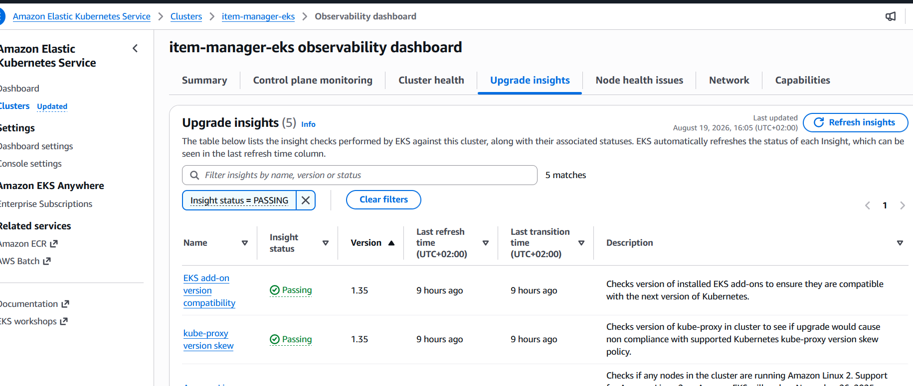
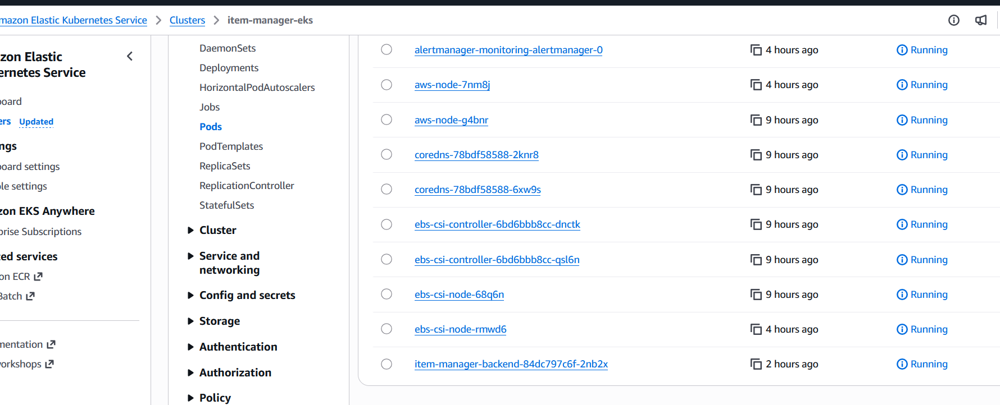

ECR before the lifecycle policy kicked in — 33 images accumulated across this whole session's
repeated build/push cycles, exactly the unbounded growth the policy above exists to prevent:

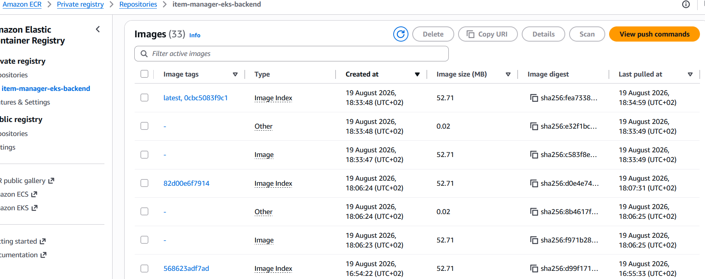

*(A screenshot of the 2 ECR repos list was pulled from here for exposing the real AWS Account
ID in the repository URIs — re-add a cropped version once retaken.)*

## Read this before running `terraform apply`

**This is not always-on infrastructure. Treat it as session-based: apply when you're
working on it, destroy when you're not.**

The EKS control plane costs **~$0.10/hour (~$73/month) flat**, and — unlike the EC2 box
elsewhere in this project — there's no way to "stop" it and pause the meter. The only way to
stop paying is `terraform destroy`.

**Rough monthly cost if left running continuously:**

| Resource | ~Monthly cost |
|---|---|
| EKS control plane | $73 |
| 1× `t3.medium` node (on-demand) | $30 |
| NAT Gateway (single, hourly + data) | $33 |
| EBS (node root + Postgres PVC) | $3 |
| LoadBalancer (frontend) | $18 |
| Secrets Manager (2 secrets) | $0.80 |
| KMS key | $1 |
| ECR storage | $1 |
| **Total** | **~$160/month** |

Compare to the existing EC2 box, which is roughly $15-20/month. This is a real ~9-10x jump,
and it's dominated by fixed costs (control plane + NAT Gateway) — leaving it idle for a month
costs the same as using it hard for a month. **Set a CloudWatch billing alarm on your AWS
account before running `terraform apply`** (e.g. $50 and $200 thresholds) — cheap/free
insurance against forgetting to tear this down.

The NAT Gateway line is a deliberate choice here, not a default: nodes sit in private
subnets and reach the internet (ECR pulls, AWS API calls) only through it, rather than
holding public IPs directly. That's a more conventional network posture, at ~$33/month more
than a public-subnet-only alternative.

> 🖼️ **Screenshot:** AWS Console → Billing → Cost Explorer (or the CloudWatch billing alarm
> you set up per the note above), showing actual spend for a session — useful as a real-world
> sanity check against the table above.
> 

## GitHub Actions RBAC scope

The CI deploy role (`aws_iam_role.github_actions`) has **cluster-admin** access
(`AmazonEKSClusterAdminPolicy`, cluster-wide) via an EKS access entry, not scoped to just the
`item-manager` namespace. This is broader than least-privilege — chosen so CI can also manage
cluster-wide resources (installing the Secrets Store CSI driver into `kube-system`, etc.)
without needing a separate, more-privileged role or further RBAC changes later. The IAM
permissions backing this role (ECR push/pull, `eks:DescribeCluster`, Secrets Manager
read/write, KMS decrypt) are still resource-scoped to exactly this project's repos/secrets/
key — cluster-admin is *inside* the cluster once authenticated, not a blank check on the AWS
account itself. Worth knowing if you ever want to narrow this later: a namespace-scoped
`AmazonEKSEditPolicy` access entry is the tighter alternative.

## State file now contains real secrets

Unlike this project's other credentials (Grafana/Alertmanager passwords on the Minikube
path, passed via `--set` at install time and never persisted anywhere), `postgres_password`
and `alertmanager_smtp_password` here are Terraform variables, written into Secrets Manager
via `aws_secretsmanager_secret_version` resources. **Terraform state records the real value
of every resource it manages — `sensitive = true` on a variable only redacts it from CLI/log
output, it does not keep the value out of `terraform.tfstate`.** Practically, this means:

- The S3 state bucket now holds real credentials and needs to be treated accordingly: keep bucket versioning + encryption enabled (SSE-S3 or SSE-KMS), and restrict `s3:GetObject` on it to only the IAM principals that actually need it.
- Avoid running `terraform show`, `terraform state show`, or `terraform output` (without `-raw`/piping to a specific field) on a shared screen or in a place that gets logged/recorded — any of these can print the real secret values to your terminal.
- `terraform plan`/`apply` output itself won't print these values (that's what `sensitive = true` does buy you) — it's specifically the state *file's contents*, and direct `state show`/`show` commands, that hold the real values.

## Prerequisites

- [Terraform >= 1.5.0](https://developer.hashicorp.com/terraform/install)
- [AWS CLI](https://aws.amazon.com/cli/), configured with credentials that can create IAM roles/OIDC providers, VPCs, EKS clusters, ECR repos, KMS keys, and Secrets Manager secrets (these are account-level permissions — confirm your AWS user/role actually has them before proceeding)
- [kubectl](https://kubernetes.io/docs/tasks/tools/) and [Helm v3](https://helm.sh/docs/intro/install/), for Phase B (deploying the app after infra is up)

## State backend setup (one-time)

Terraform state for this config lives in S3, not locally — see "State file now contains real
secrets" above for why that matters here specifically, beyond the usual "protect it from a
lost laptop disk" reasoning. The bucket must exist *before* `terraform init` can use it (S3
backends can't bootstrap their own bucket):

```bash
aws s3 mb s3://<a-globally-unique-bucket-name> --region <your-region>
aws s3api put-bucket-versioning --bucket <a-globally-unique-bucket-name> --versioning-configuration Status=Enabled
aws s3api put-bucket-encryption --bucket <a-globally-unique-bucket-name> --server-side-encryption-configuration '{"Rules":[{"ApplyServerSideEncryptionByDefault":{"SSEAlgorithm":"AES256"}}]}'
```

*(A screenshot of the bucket's `terraform.tfstate` object in the S3 console was pulled from
here for exposing the real AWS Account ID in the account switcher — re-add a cropped version
once retaken.)*

## Apply

```bash
cd terraform
cp terraform.tfvars.example terraform.tfvars
# Edit terraform.tfvars — aws_region, and the two REPLACE_WITH_* secret values

terraform init -backend-config="bucket=<your-state-bucket-name>" -backend-config="region=<your-region>"
terraform plan    # review what it's about to create before applying
terraform apply
```

> 🖼️ **Screenshots:** a real `terraform apply` plan (80 resources to add, 0 to change/destroy
> — a fresh cluster) and the `Outputs:` block once it completes (account ID blurred by hand
> before this screenshot was taken — worth doing the same if you ever paste your own).

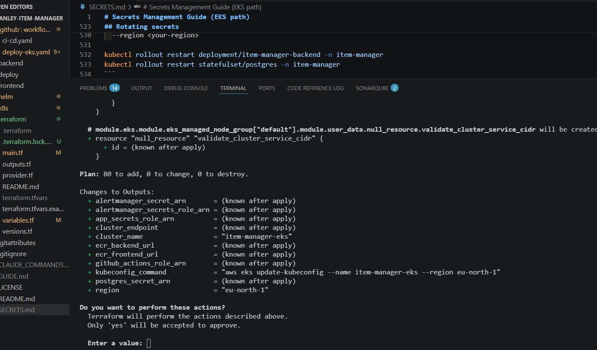
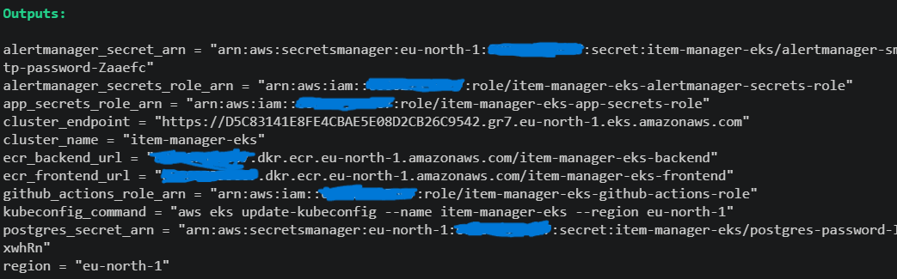

Takes 10-15 minutes — EKS cluster creation is slow. Once it completes, the real secret
values you put in `terraform.tfvars` are already in Secrets Manager — no separate
`put-secret-value` step needed this time:

```bash
terraform output   # see everything you'll need for Phase B/C (ECR URLs, role ARNs, secret ARNs)

# Point kubectl/helm at the new cluster:
$(terraform output -raw kubeconfig_command)

kubectl get nodes   # should show 1-2 nodes, Ready, within a few minutes of the node group finishing
```

> 🖼️ **Screenshots:** AWS Console → EC2 → Instances, filtered to the worker nodes — instance
> details and Tags tab, showing `ManagedBy: terraform` / `Project: item-manager-eks` and
> confirming the node-tagging from `main.tf` took effect.
>
> *(One instance-details screenshot was pulled from here for exposing the real AWS Account ID
> in its Instance ARN — re-add a cropped version once retaken.)*

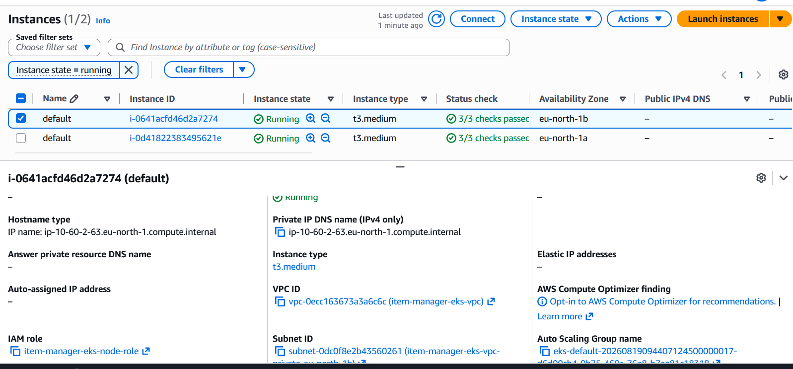
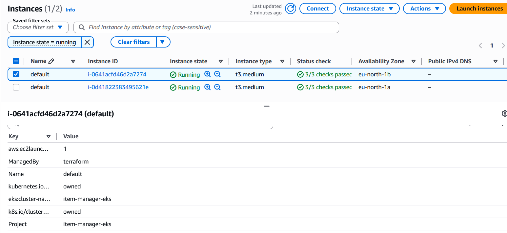
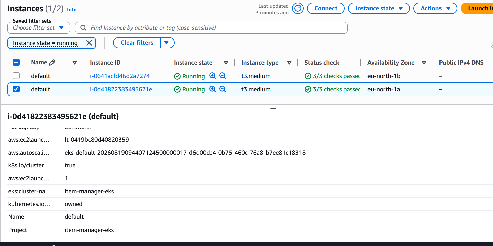

## Verify the deployment

Once `deploy-eks.yaml` (or a manual `helm upgrade --install`, per `../SECRETS.md`'s Setup
Guide) has run, this is what a genuinely healthy deployment looks like — not just `kubectl get
pods` showing `Running`, but the app actually reachable and the monitoring stack actually
scraping it:

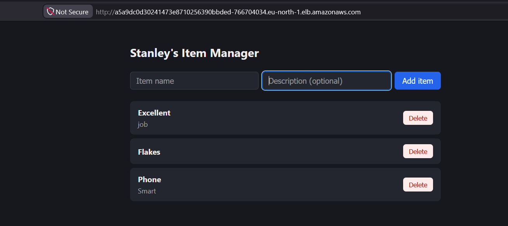

That's the end state. Getting there included a real bug worth knowing about if you hit the
same symptom: `POST /api/items` returning a bare `502 Bad Gateway` with zero backend request
logs, while the page itself loaded fine. Root cause was `frontend/nginx.conf`'s `resolver`
directive hardcoded to Minikube's CoreDNS ClusterIP (`10.96.0.10`) — meaningless on EKS, which
uses a completely different Service CIDR. Fixed by resolving the real nameserver from
`/etc/resolv.conf` at container startup instead (see `frontend/resolve-dns.sh` and
`frontend/Dockerfile`'s `/docker-entrypoint.d/` hook) rather than hardcoding any one cluster's
DNS IP:

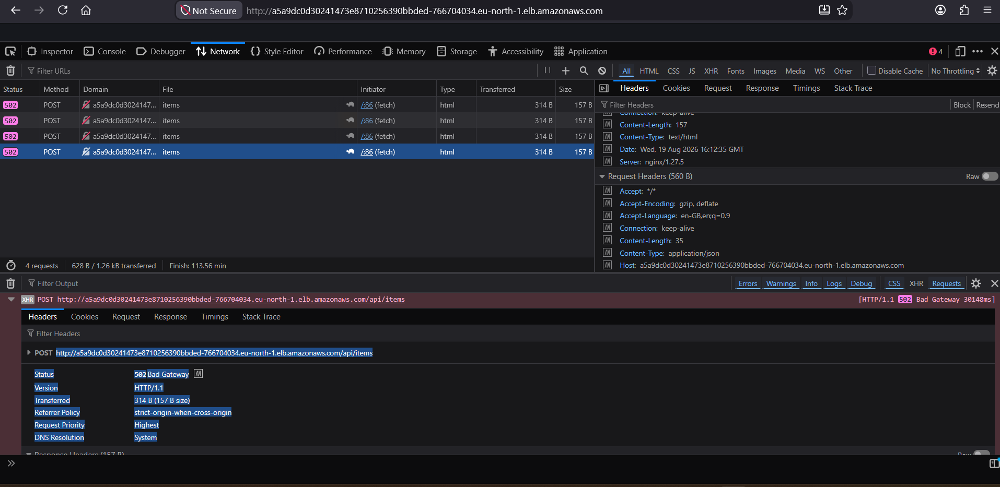

Monitoring evidence, once the stack is up (port-forward `monitoring-grafana`/`monitoring-prometheus`
per `../SECRETS.md` or `../helm/monitoring/README.md` to view these yourself):

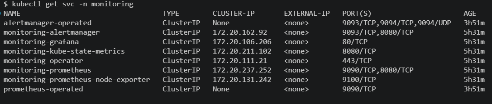
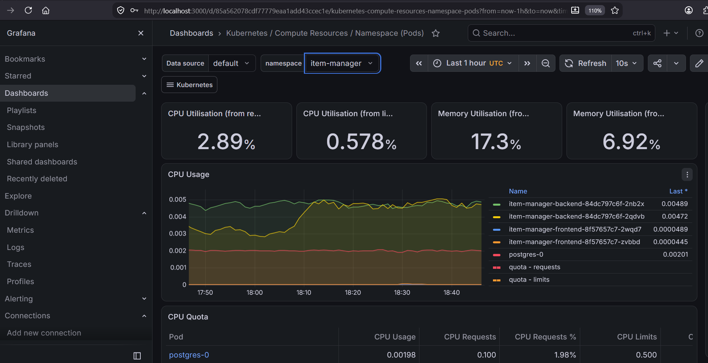
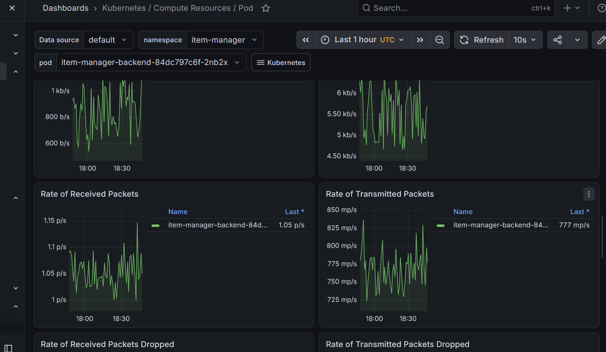
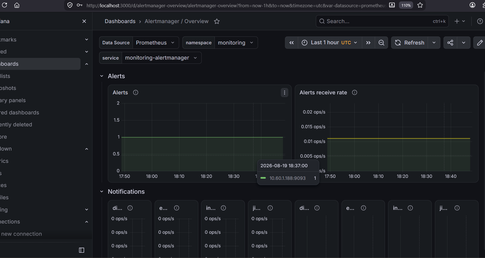
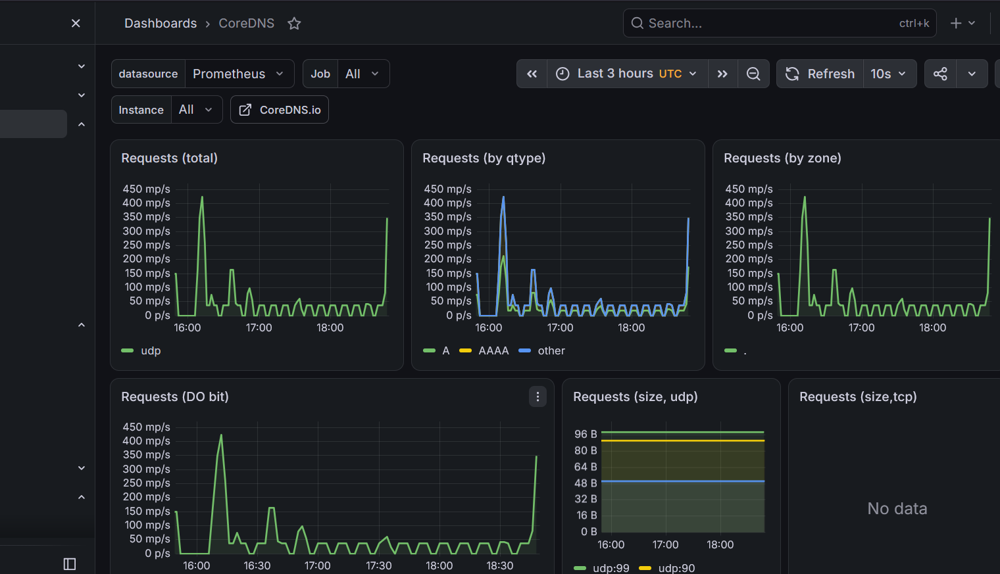
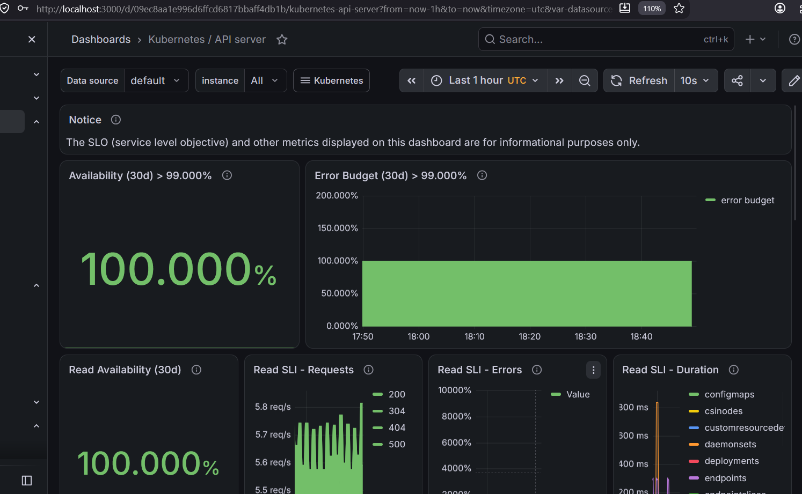
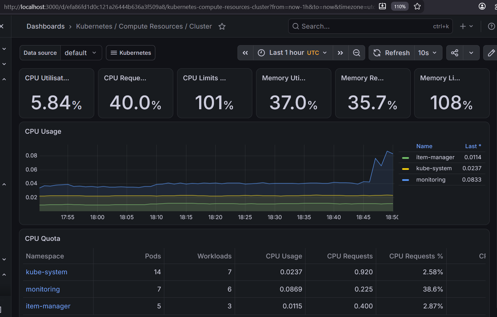
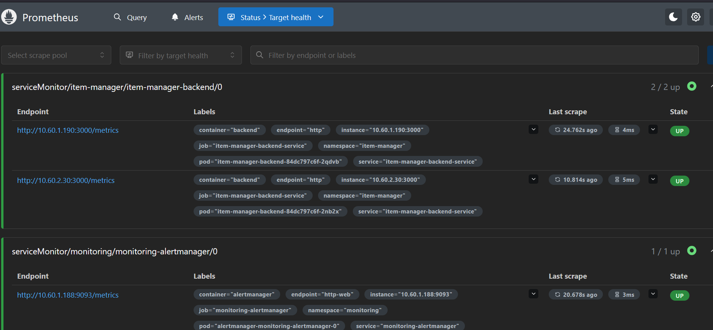

## Destroy

**Do this when you're done working — this is the step that actually stops billing.**

```bash
cd terraform
terraform destroy
```

Verify nothing was left behind:
```bash
terraform state list   # should be empty
```
Worth a spot-check in the AWS Console too (VPC, EKS cluster, ECR repos, IAM roles, Secrets
Manager secrets) the first few times, until you trust the teardown is clean.

## What's NOT in this config

- No Cluster Autoscaler / Karpenter — fixed 1-2 node count is intentional for a cost-capped demo cluster.
- No ALB Ingress Controller — the frontend uses a plain `Service: LoadBalancer` (provisions a Classic ELB) for this iteration, to avoid the extra controller + IAM policy.

The monitoring stack (Prometheus/Grafana/Alertmanager) **is** deployed on this path — see
`helm/monitoring/values-monitoring-eks.yaml` and `../SECRETS.md`. It runs on the same
`t3.medium` node as the app; if you're seeing resource pressure once monitoring's added,
the same options `helm/monitoring/README.md` documents for the EC2 path apply here too
(trim resource requests, or move to a bigger `node_instance_type`).
